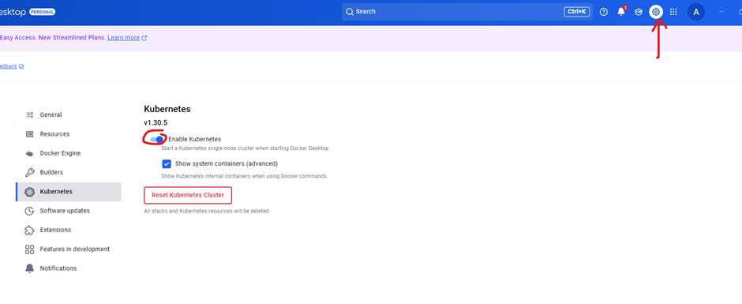
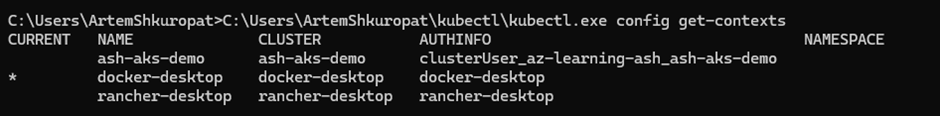

```
az account show

az logout

az login

az account list --output table

az account set --subscription "<subscription-name-or-id>"

az account show

az account tenant list

```

Use Docker Desktop with Enebled Kubernetes


Waiting until status Desktop Docker is running
```
az login

az account set --subscription $SUBSCRIPTION

az provider register --namespace Microsoft.KubernetesConfiguration --wait

az extension add --name k8s-extension --upgrade --yes

az group create --name $AKS_CLUSTER_GROUP_NAME --location $LOCATION
```

Check Your Kubernetes Context

Run the following command to list your Kubernetes contexts:
```
kubectl config get-contexts
```
You’ll see output like this:


IF on the way any issues:
1. Download kubectl
Visit the Kubernetes releases page: Kubernetes Releases.

Download the Windows binary for the latest stable version. For example:
```
  https://dl.k8s.io/release//bin/windows/amd64/kubectl.exe
```
C:\Users\<YourUsername>\kubectl

Check it:

C:\Users\<YourUsername>\kubectl\kubectl.exe version --client

Create a Script to Simplify Usage

If running the full path every time is cumbersome, you can create a batch file to simplify the process:

Open Notepad and create a new file.

Add the following line, replacing <YourUsername> with your username:

@echo off
C:\Users\<YourUsername>\kubectl\kubectl.exe %*

Save the file as kubectl.bat in a directory that's already in your PATH, such as:

C:\Users\<YourUsername>\

Now, you can use kubectl as a regular command:
```
kubectl version --client
```
Verify Kubernetes Context

Ensure that your kubectl is pointing to the Docker Desktop Kubernetes cluster:

C:\Users\<YourUsername>\kubectl\kubectl.exe config get-contexts

Switch to docker-desktop
```
  C:\Users\<YourUsername>\kubectl\kubectl.exe config use-context docker-desktop
```

Verify the cluster is working:
C:\Users\<YourUsername>\kubectl\kubectl.exe get nodes


To create AKS cluster is OPTIONAL
```
az aks create 
   --resource-group $AKS_CLUSTER_GROUP_NAME 
   --name $AKS_NAME 
   --enable-aad 
   --generate-ssh-keys 
   --enable-cluster-autoscaler 
   --max-count 6 
   --min-count 1
```
Connect Kubernetes cluster to Azure Arc
To create your Azure Arc-enabled Kubernetes cluster, connect your Kubernetes cluster to Azure Arc.
Install the following Azure CLI extensions:

```
az extension add --name connectedk8s --upgrade --yes 
```
```
az extension add --name k8s-extension --upgrade --yes 
```
```
az extension add --name customlocation --upgrade --yes 
```
```
az extension add --name containerapp --upgrade --yes
```

Register the following required namespaces:
```
az provider register --namespace Microsoft.ExtendedLocation --wait
```
```
az provider register --namespace Microsoft.KubernetesConfiguration --wait
```
```
az provider register --namespace Microsoft.App --wait
```
```
az provider register --namespace Microsoft.OperationalInsights --wait
```
Check Registration Status
```
az provider show --namespace Microsoft.ExtendedLocation --query "registrationState" --output table
```
```
az provider show --namespace Microsoft.KubernetesConfiguration --query "registrationState" --output table
```
```
az provider show --namespace Microsoft.App --query "registrationState" --output table
```
```
az provider show --namespace Microsoft.OperationalInsights --query "registrationState" --output table
```

Now is two options to Install the Kubernetes command line interface (CLI) named kubectl:

OPTION 1:

Use PowerShell:
```
Set-ExecutionPolicy Bypass -Scope Process -Force; [System.Net.ServicePointManager]::SecurityProtocol = [System.Net.ServicePointManager]::SecurityProtocol -bor 3072; iex ((New-Object System.Net.WebClient).DownloadString('https://chocolatey.org/install.ps1'))

choco install kubernetes-cli -y
```

OPTION 2:
Use Chocolatey Without Admin Rights
If you want to use Chocolatey without admin rights, you need to reconfigure Chocolatey to install packages in a user-accessible directory (like C:\Users\<YourUsername>\choco).

Steps:
Install Chocolatey Without Admin Rights
```
$env:ChocolateyInstall = "$env:USERPROFILE\choco"
```
```
[System.Net.ServicePointManager]::SecurityProtocol = [System.Net.ServicePointManager]::SecurityProtocol -bor 3072
Invoke-WebRequest https://community.chocolatey.org/install.ps1 -UseBasicParsing | Invoke-Expression
```

Add Chocolatey to the PATH (for the current user only):
```
setx PATH "%PATH%;$env:USERPROFILE\choco\bin"
```
Restart the Command Prompt (or PowerShell).

Verify the Chocolatey Installation:
```
  choco –version
```

**IF BOTH WAY SHOW ERROR DURING INSALLING OF CHOCOLATEY USE OPTION 2 OF HELM INSTALLATION

Install the Kubernetes package manager named Helm:
OPTION 1:
If Chocolatey installation works for us we can use this scrip:

Install the Kubernetes package manager named Helm:
```
choco install kubernetes-helm
```

OPTION 2:
INSTALL HELM MANUALLY (without Chocolatey)
Download the Helm binary:

Go to the https://github.com/helm/helm/releases.

Download the latest Windows .zip file (e.g., helm-v#####-windows-amd64.zip).

Extract the Helm binary:

Extract it to a directory where you have write permissions, like:
```
makefile
```
C:\Users\<YourUsername>\helm\

Add Helm to your PATH (without admin rights):

Open PowerShell or Command Prompt.

Run the following command to add Helm to your user PATH:
```
setx PATH "%PATH%;C:\Users\<YourUsername>\helm\"
```
Verify the Installation:
```
helm version
```
Confirm that the SMB driver is installed by running the following kubectl command, which should list smb.csi.k8s.io:
```
kubectl get csidriver
```

# Connect your K8 cluster to Azure Arc
```
az connectedk8s connect --name $CONNECTED_CLUSTER_NAME--resource-group $GROUP_NAME
```

Validate the connection between Azure Arc and your Kubernetes cluster:
```
az connectedk8s show 
   --resource-group $GROUP_NAME 
   --name $CONNECTED_CLUSTER_NAME
```
If the output shows that the provisioningState property value isn't set to Succeeded, run the command again after one minute.

Create an Azure Log Analytics workspace

You can create an optional, but recommended, Azure Log Analytics workspace, which provides access to logs for apps that run in your Azure Arc-enabled Kubernetes cluster.

Create the Log Analytics workspace:
```
az monitor log-analytics workspace create --resource-group $GROUP_NAME --workspace-name $WORKSPACE_NAME
```
Get the base64-encoded ID and shared key for your Log Analytics workspace. You need these values for a later step.
```
LOG_ANALYTICS_WORKSPACE_ID=$(az monitor log-analytics workspace show --resource-group $GROUP_NAME --workspace-name $WORKSPACE_NAME --query customerId --output tsv)

LOG_ANALYTICS_WORKSPACE_ID_ENC=[Convert]::ToBase64String([System.Text.Encoding]::UTF8.GetBytes(“$LOG_ANALYTICS_WORKSPACE_ID”))

LOG_ANALYTICS_KEY=$(az monitor log-analytics workspace get-shared-keys --resource-group $GROUP_NAME --workspace-name $WORKSPACE_NAME --query primarySharedKey --output tsv)

LOG_ANALYTICS_KEY_ENC=[Convert]::ToBase64String([System.Text.Encoding]::UTF8.GetBytes($LOG_ANALYTICS_KEY))
```

Create and install the Azure Container Apps extension

Now, create and install the Azure Container Apps extension with your Azure Arc-enabled Kubernetes cluster as an on-premises resource.

Create and install the extension with Log Analytics enabled for your Azure Arc-enabled Kubernetes cluster. You can't later add Log Analytics to the extension.
```
az k8s-extension create --resource-group $GROUP_NAME --name $EXTENSION_NAME --cluster-type connectedClusters --cluster-name $CONNECTED_CLUSTER_NAME --extension-type 'Microsoft.App.Environment' --release-train stable --auto-upgrade-minor-version true --scope cluster --release-namespace $NAMESPACE --configuration-settings "Microsoft.CustomLocation.ServiceAccount=default" --configuration-settings "appsNamespace=${NAMESPACE}" --configuration-settings "keda.enabled=true" --configuration-settings "keda.logicAppsScaler.enabled=true" --configuration-settings "keda.logicAppsScaler.replicaCount=1" --configuration-settings "containerAppController.api.functionsServerEnabled=true" --configuration-settings "envoy.externalServiceAzureILB=false" --configuration-settings "functionsProxyApiConfig.enabled=true" --configuration-settings "clusterName=${CONNECTED_ENVIRONMENT_NAME}"" --configuration-settings "logProcessor.appLogs.destination=log-analytics" --configuration-protected-settings "logProcessor.appLogs.logAnalyticsConfig.customerId=${LOG_ANALYTICS_WORKSPACE_ID_ENC}" --configuration-protected-settings "logProcessor.appLogs.logAnalyticsConfig.sharedKey=${LOG_ANALYTICS_KEY_ENC}"
```

* envoy.annotations.service.beta.kubernetes.io/azure-load-balancer-resource-group=${GROUP_NAME}"
* Add line above only when the underlying cluster is Azure Kubernetes Service.

Save the ID value for the Azure Container Apps extension to use later:
```
EXTENSION_ID=$(az k8s-extension show --cluster-type connectedClusters --cluster-name $CONNECTED_CLUSTER_NAME --resource-group $GROUP_NAME --name $EXTENSION_NAME --query id --output tsv)
```
Before you continue, wait for the extension to fully install. To have your terminal session wait until the installation completes, run the following command:
```
az resource wait --ids $EXTENSION_ID --custom "properties.provisioningState!='Pending'" --api-version "2020-07-01-preview"
```

Create your custom location

```
CUSTOM_LOCATION_NAME="my-custom-location"
```
```
CONNECTED_CLUSTER_ID=$(az connectedk8s show --resource-group $GROUP_NAME --name $CONNECTED_CLUSTER_NAME --query id --output tsv)
```
Create the custom location:
```
az customlocation create --resource-group $GROUP_NAME --name $CUSTOM_LOCATION_NAME --host-resource-id $CONNECTED_CLUSTER_ID --namespace $NAMESPACE --cluster-extension-ids $EXTENSION_ID --location $LOCATION
```
Validate that the custom location is successfully created:
```
az customlocation show --resource-group $GROUP_NAME --name $CUSTOM_LOCATION_NAME
```
If the output shows that the provisioningState property value isn't set to Succeeded, run the command again after one minute.

Save the custom location ID for use in a later step:
```
CUSTOM_LOCATION_ID=$(az customlocation show --resource-group $GROUP_NAME --name $CUSTOM_LOCATION_NAME --query id --output tsv)
```
Now, create your Azure Container Apps connected environment for your Standard logic app to use.
```
az containerapp connected-env create --resource-group $GROUP_NAME --name $CONNECTED_ENVIRONMENT_NAME --custom-location $CUSTOM_LOCATION_ID --location $LOCATION
```